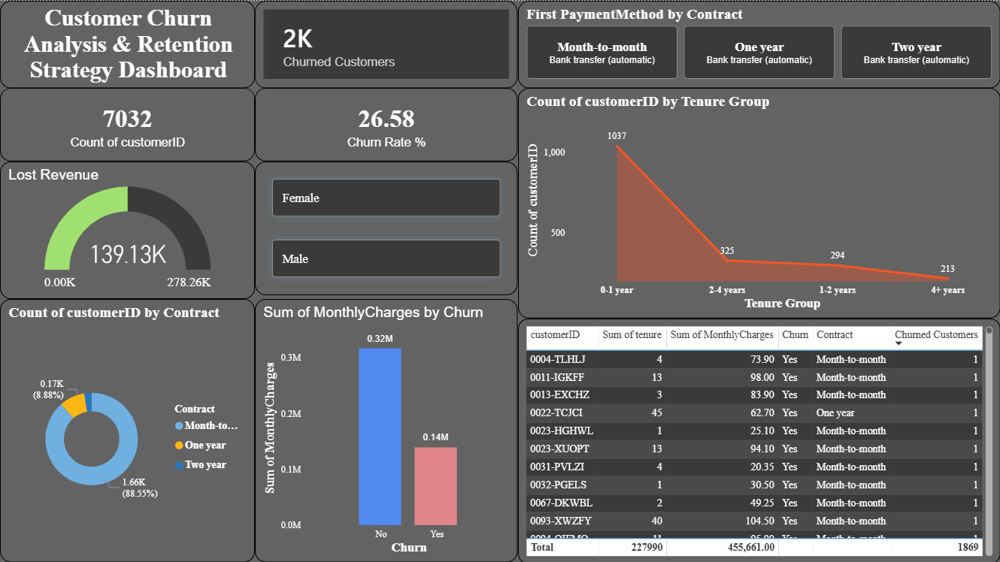

# Customer Churn Analysis & Retention Strategy (SQL + Power BI)

## 📌 Problem Statement

Customer churn is a major challenge for subscription-based businesses, leading to revenue loss and reduced customer lifetime value.
This project analyses customer behaviour using the IBM Telco Customer Churn dataset to identify key drivers of churn and provide actionable strategies to improve customer retention.

---

## 📊 Dashboard Preview



---

## 🛠️ Tools & Technologies

* SQL (MySQL)
* Power BI
* Python (Pandas, Matplotlib)
* Jupyter Notebook

---

## 🔄 Project Workflow

1. Data cleaning and preprocessing using Python (Pandas)
2. Data stored and queried using MySQL database
3. SQL used to analyse churn patterns and customer segments
4. Power BI used to build an interactive dashboard
5. Insights translated into business recommendations

---

## 📈 What I Analysed

* Overall churn rate across the customer base
* Churn breakdown by contract type (month-to-month vs 1-year vs 2-year)
* Churn behaviour across different tenure stages
* Relationship between monthly charges and churn likelihood
* Customer segmentation based on pricing tiers

---

## 💡 Key Insights

* Month-to-month contracts show the highest churn (~42%), compared to ~11% for long-term contracts
* Customers in their first year are significantly more likely to churn
* Higher monthly charges are associated with increased churn risk
* Customer retention improves significantly after long-term engagement

---

## 🚀 Business Recommendations

* Incentivise long-term contracts through discounts or loyalty programmes
* Improve onboarding experience for new customers to reduce early churn
* Target high-value customers (high monthly charges) with personalised retention strategies
* Monitor high-risk segments and implement proactive engagement strategies

---

## ⭐ Project Highlights

* End-to-end data analysis project (SQL → Python → Power BI)
* Business-focused insights for customer retention
* Interactive dashboard with KPI tracking
* Real-world telecom dataset with 7,000+ customer records

---

## 📌 Business Impact

This project demonstrates how data-driven insights can help businesses reduce churn, improve retention strategies, and increase long-term revenue.

---

## 📁 Repository Structure

* Customer Churn Analysis.ipynb → Python analysis
* Customer Churn Analysis.html → Viewable report
* Telco Customer Churn.csv → Dataset
* dashboard.png → Power BI dashboard
* sql/churn_queries.sql → SQL queries

---

## ▶️ How to Run

```bash
git clone https://github.com/vyjayanthik/customer-churn-analysis
cd customer-churn-analysis
jupyter notebook "Customer Churn Analysis.ipynb"
```

---

## 👤 About

Built by **Vyjayanthi Kadapanatham**
MSc Data Science (Distinction), University of Hertfordshire

Seeking Graduate / Junior Data Analyst roles in the UK

🔗 LinkedIn: https://linkedin.com/in/k-vyjayanthi
🔗 GitHub: https://github.com/vyjayanthik
